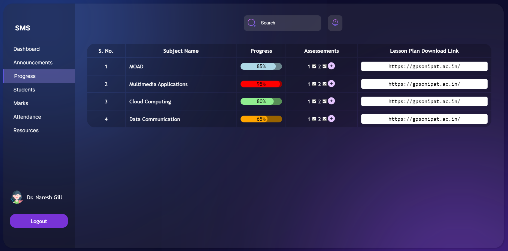

## 
 Comprehensive Student Progress and Attendance Tracking Platform

Welcome to the web-based platform designed to revolutionize student progress and attendance monitoring within educational institutions. In today's dynamic educational landscape, accurate assessment and tracking of student performance are paramount. Our platform offers a sophisticated solution that empowers educators, administrators, parents, and students to make data-driven decisions for improved learning outcomes.

## Overview

In the pursuit of creating a more effective educational environment, our platform addresses the challenges of manual methods for monitoring student progress and attendance. We present an innovative, web-based solution that streamlines the process of measuring, analyzing, and tracking student performance and attendance, enabling timely interventions and fostering academic success.

## Objectives

Our platform's primary objectives are as follows:

- **User-Friendly Interface**: Provide intuitive access to attendance and performance data for students, educators, administrators, and parents.
- **Automated Attendance Recording**: Automate attendance tracking to reduce administrative burdens and ensure accuracy.
- **Efficient Performance Management**: Allow educators to input and manage student performance data seamlessly.
- **Comprehensive Reporting**: Generate insightful reports and analytics on attendance and academic progress.
- **Enhanced Communication**: Foster better communication and collaboration between stakeholders.
- **Student Empowerment**: Empower students to monitor their attendance and progress actively.

## Scope

The platform encompasses several key features:

- **User Authentication and Role-Based Access Control**: Ensuring data security and privacy through controlled access.
- **Attendance Tracking**: Streamlining attendance recording and monitoring for educators.
- **Performance Management Tools**: Facilitating easy input and management of grades and assessments.
- **Real-Time Analytics and Reporting**: Generating actionable insights into attendance trends and academic performance.
- **Mobile Compatibility**: Enabling access to the platform on various devices for convenience.

## Platform Screenshots

*Login Page - Secure access to the platform for educators, administrators, and students.*

*Attendance Tracking - Effortless recording and monitoring of student attendance.*

*Performance Dashboard - An insightful overview of student performance and progress.*

## Running the Server

To run the website with backend capabilities, follow these steps:

1. Navigate to the server directory using the command line.
2. Run the command `node src/index.js`.

Once the server is up and running, the website will be able to fetch data from files and provide a comprehensive experience.

## Target Audience

Our platform caters to a diverse range of stakeholders:

- **Students**: Empower them to take control of their attendance and academic progress.
- **Educators**: Streamline administrative tasks, manage grades, and gain insights into student performance.
- **Administrators**: Make informed decisions based on comprehensive attendance and progress data.
- **Parents**: Stay engaged with their child's education by monitoring attendance and progress.

## Technologies Used

To develop this cutting-edge platform, we leveraged the following technologies:

- **Figma**: Collaborative design tool for user interface and user experience design.
- **Visual Studio Code**: Feature-rich source-code editor for streamlined development.
- **Languages**: HTML, CSS, and JavaScript for building interactive and responsive web elements.

## Conclusion

Our web-based platform is poised to transform student progress and attendance monitoring. By embracing technology and data-driven insights, we aim to enhance educational outcomes and facilitate better communication among stakeholders. Together, let's usher in a new era of effective education.

Feel free to explore our platform and contribute to its continuous improvement!
